# Bookstore Application - Project Documentation

This document provides a comprehensive overview of the implementation, architecture, and security design of the Bookstore application.

## 1. System Architecture

The application follows a classic **3-Tier Architecture** deployed on Kubernetes/OpenShift, utilizing namespaces for strict logical isolation.

### High-Level Architecture

```mermaid
graph TD
    User["🌍 End User"] -- "HTTP (8080)" --> Frontend
    
    subgraph "Frontend Namespace"
        Frontend["🏢 Nginx Frontend"]
    end
    
    subgraph "Backend Namespace"
        Backend["⚙️ Node.js API"]
    end
    
    subgraph "Database Namespace"
        MySQL[("💾 MySQL (StatefulSet)")]
        Redis[("⚡ Redis (StatefulSet)")]
    end

    Frontend -- "Proxy API Requests" --> Backend
    Backend -- "SQL Queries" --> MySQL
    Backend -- "Cache Ops" --> Redis
```

## 2. Component Implementation

### 🛡️ Namespace Strategy
We implemented a **Namespace-per-Tier** strategy to enforce the principle of least privilege:
- `frontend`: Contains the web server and public-facing assets.
- `backend`: Houses the business logic and API layer.
- `database`: Stores persistent data and caching engines.

### 🍱 Component Breakdown

| Component | Technology | Description |
| :--- | :--- | :--- |
| **Frontend** | Nginx | Serves static JS/CSS and handles API routing via `proxy_pass`. |
| **Backend** | Node.js / Express | REST API that manages the bookstore inventory. |
| **Database** | MySQL 8.0 | Primary persistent storage for book records. |
| **Caching** | Redis 7.0 | In-memory store for high-performance data retrieval. |

---

## 3. Network & Security

### 🔒 Network Topology (Data Flow)
Interaction between tiers is strictly controlled via Kubernetes **Network Policies**.

### 🛡️ Security Implementation
1. **Security Headers**: Frontend Nginx is configured with strict CSP (Content Security Policy), HSTS, and X-Frame-Options.
2. **Persistence**: Managed via `StatefulSets` to ensure stable network IDs and consistent storage mounting for the database tier.
3. **Vulnerability Management**: Automated scans via `Trivy` check all images for known package-level vulnerabilities.
4. **Environment Isolation**: Sensitive credentials (like DB passwords) are strictly managed through Kubernetes Secrets.

---

## 4. Automation & DevOps

The project includes several tools to streamline development and security audits:

### 🚀 Local Launch Tool
The `[launch-app.sh](file:///home/kenzy/OPenShift/launch-app.sh)` script automates the developer workflow:
- Verifies pod health.
- Manages port-forwarding to internal services.
- Opens the application in the local browser.

### 🔍 Security Audit Tool
The `[trivy-scan.sh](file:///home/kenzy/OPenShift/trivy-scan.sh)` script provides one-touch security reporting:
- Dynamically identifies images from the running cluster.
- Generates Table-formatted reports in both `.md` and `.txt`.
- Saves findings in the `security-reports/` directory.

---

## 5. Deployment Information
The application is deployed using **Helm Charts**, allowing for templated, repeatable environments across different stages (Dev, Prod, etc.).

- **Charts Root**: `[helm-charts/](file:///home/kenzy/OPenShift/helm-charts/)`
- **Frontend URL**: `http://localhost:8080` (via local port-forward)
